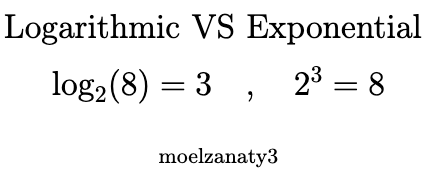

# Big O Time Complexity

Hi there 👋, in this note, we will talk about Big O Notation, what is it? why we need it? and how to use it?

- [Big O Time Complexity](#big-o-time-complexity)
  - [What is Big O Notation?](#what-is-big-o-notation)
  - [Why do we need Big O Notation?](#why-do-we-need-big-o-notation)
  - [Complexity Analysis](#complexity-analysis)
    - [Time complexity](#time-complexity)
    - [Space complexity](#space-complexity)
  - [Time Complexities](#time-complexities)
    - [Constant Time - O(1) Algorithm 🕒](#constant-time---o1-algorithm-)
    - [Logarithmic Time - O(log n) Algorithm 📉](#logarithmic-time---olog-n-algorithm-)
    - [Linear Time - O(n) Algorithm 📈](#linear-time---on-algorithm-)
    - [Quadratic Time - O(n²) Algorithm 🔄](#quadratic-time---on-algorithm-)
    - [Exponential Time - O(2^n) Algorithm 📈](#exponential-time---o2n-algorithm-)
  - [Key Considerations in Analyzing Time Complexity ⏱️](#key-considerations-in-analyzing-time-complexity-️)
  - [References](#references)

## What is Big O Notation?

<table>
  <tr>
    <td>

Imagine you have a huge box of `LEGO blocks` and you want to find a specific blue block. Big O notation is like a way of describing how long it might take you to find that block. So if you have a box of 10 blocks, it might take you 10 seconds to find that block. If you have a box of 100 blocks, it might take you 100 seconds to find that block. If you have a box of 1000 blocks, it might take you 1000 seconds to find that block. So the time it takes you to find that block is directly proportional to the size of the box. And that's what Big O notation is. It's a way of describing how long it might take you to find that block as the size of the box grows.

**Technically speaking, Big O is theoretical definition of the complexity of an algorithm as function of the size. a notation used to describe  complexity and what i mean by notation  is that it simplifies everything in the algorithm down into a single variable**

Big O is a useful notation for  understanding both time and space  complexity but only when comparing  amongst algorithms that solve the same  problem  the last bit in that definition of Big O  is a function of the size and all this  means is that Big O measures complexity  as the input size grows because it's not  important to understand how an algorithm  performs in a single data set but in all  possible data sets  you will

> TIP💡: Big O referred to as  the `upper bound` of the algorithm and  what that means is that Big O measures  how the algorithm performs in the worst  case scenario  so that's all Big O is  nothing special.
    </td>
    <td>
      
    </td>
  </tr>
</table>

## Why do we need Big O Notation?

Every problem has multiple solutions, and each solution has its own pros and cons. So when you're trying to solve a problem, you need to consider the time and space complexity of each solution to determine which one is the best for your use case. Big O notation is a way to measure the efficiency of an algorithm, and it's used to compare different solutions to the same problem. It's also used to determine the best solution for a given problem.

for example, let's say we need to implement a function that reverse a string, we can do it in many ways, but we will focus on three ways:

- Using the built-in `reverse` method.

  ```js
  function reverseString(str) {
    return str.split("").reverse().join("");
  }
  ```

- Using a `for` loop.

  ```js
  function reverseString(str) {
    let reversed = "";
    for (let i = str.length - 1; i >= 0; i--) {
      reversed += str[i];
    }
    return reversed;
  }
  ```

- Using the `reduce` method.

  ```js
  function reverseString(str) {
    return str.split("").reduce((reversed, character) => {
      return character + reversed;
    }, "");
  }
  ```

more implementations can be found [here](https://stackoverflow.com/a/51751393/18863976), but my point is that we have multiple solutions to the same problem, and each solution has its own pros and cons, so we need to know which solution is the best for our use case, and that's where Big O notation comes in so Is Big Notation important? the answer is

- Yes, because it's important to know how long your code will take to run.
- It's important to know how much memory your code will take up.
- It's important to know how your code will scale.

> NOTE💡: The world we live in today consists of complicated apps and software, each running on various devices and each having different capabilities. Some devices like desktops can run heavy machine learning software, but others like phones can only run apps. So when you create an application, you’ll need to optimize your code so that it runs smoothly across devices to give you an edge over your competitors. ⏤ [Big O Notation Cheat Sheet](https://flexiple.com/algorithms/big-o-notation-cheat-sheet)

## Complexity Analysis

The process of determining how efficient an algorithm is. Complexity analysis usually involves finding both the time complexity and the space complexity of an algorithm.

simply it determines how `good` an algorithm is, and by `good` I mean how fast it runs and how much memory it takes up. weather it's `better` than another algorithm or not.

### Time complexity

A measure of how fast an algorithm runs, it describes the amount of time necessary to execute an algorithm.

When ⏱️ analyzing an algorithm's time complexity, we encounter three scenarios: *best-case*, *average-case*, and *worst-case*, each portraying different performance scenarios. Suppose we have the following unsorted list [1, 5, 3, 9, 2, 4, 6, 7, 8] and we need to find the index of a value in this list using linear search.

- *Best-case*: 🌟 this is the complexity of solving the problem for the best input. In our example, the best case would be to search for the value 1. Since this is the first value of the list, it would be found in the first iteration.

- *Average-case*: 📊 this is the average complexity of solving the problem. This complexity is defined with respect to the distribution of the values in the input data. Maybe this is not the best example but, based on our sample, we could say that the average-case would be when we’re searching for some value in the “middle” of the list, for example, the value 2.

- *Worst-case*: ⚠️  this is the complexity of solving the problem for the worst input of size n. In our example, the worst-case would be to search for the value 8, which is the last element from the list.

Generally, when discussing an algorithm's time complexity, emphasis is often placed on *the worst-case* scenario as it illustrates the maximum time required for a given input size, providing a conservative estimation of performance.

worth to mention also that the time complexity is not a measure of the actual time taken to run an algorithm, instead, it is a measure of how the time taken scales with change in the input length. so we are not talking about seconds or milliseconds, or how many cycles it takes to run an algorithm, but rather how many operations it takes to run an algorithm as *a function of the size of the input*.

the question now is **What's function of the size of the input 😂?** in terms of time:-

the `Function of the size of the input` in terms of time means that the time it takes for a computer program (or algorithm) to finish depends on how many items it has to work with.

Let's look at two examples using JavaScript, which involve doing something with an array of numbers.

- Example 1: Fixed Number of Steps

  ```javascript
  let arr = [1, 2, 3, ...]; // This is an array with some numbers

  for (let i = 0; i < 4; i++) {
    console.log(arr[1]); 
  }
  ```

  In this example, no matter how big the array is, the program always does the same thing **four times**. It's like saying, "No matter how many toys I have, I will only play with the fourth one, four times." This takes the same amount of time, whether you have 10 toys or 1000. We call this O(1) or constant time because it doesn't change with the number of items.

- Example 2: Steps Depend on Number of Items

  ```javascript
  let arr = [1, 2, 3, ...]; // This is an array with some numbers

  for (let i = 0; i < arr.length; i++) {
      console.log(arr[i]);
  }
  ```

  In this second example, the program looks at each number in the array, one by one. If you have 5 numbers, it looks 5 times. If you have 100 numbers, it looks 100 times. The more numbers you have, the longer it takes. This is like saying, "I will look at each toy I have, one by one." If you have more toys, it takes more time. We call this O(n), where 'n' is the number of items, because the time it takes grows with the number of items.

So, when we say `function of the size of the input` about time, we're talking about how the number of items in the input (like numbers in an array) affects how long the program takes to run.


### Space complexity

A measure of how much auxiliary memory an algorithm takes up, simply compute how much space the variables in an algorithm take up.

> The best algorithms should have the least space complexity. The lesser the space used, the faster it executes as *a function of the size of the input*.

the question now is **What's function of the size of the input 😂?** in terms of space complexity:-

Talking about `space complexity` is like thinking about how much room you need in your backpack for your school stuff. Just like your backpack can only hold so many books and pencils, a computer program can only use a certain amount of space (or memory) on your computer.

When we say `function of the size of the input` in terms of space complexity, we're looking at how much extra space a computer program needs based on the number of things it's working with.

Let's use two JavaScript examples to understand this better:

- Example 1: Fixed Space Usage

  ```javascript
  function sumOfFirstTwo(arr) {
      return arr[0] + arr[1];
  }
  ```

  In this program, no matter how big the array `arr` is, we only use a tiny bit of extra space to store the sum of the first two numbers. It's like only needing space for two pencils in your backpack, regardless of how many pencils you actually have. This has a constant space complexity, or O(1), because it doesn't need more space if you have more items.

- Example 2: Space Depends on Number of Items

  ```javascript
  function copyArray(arr) {
      let newArr = [];
      for (let i = 0; i < arr.length; i++) {
          newArr.push(arr[i]);
      }
      return newArr;
  }
  ```

  In this second example, we make a new array that's just like the one we started with. If your original array has 5 numbers, the new array also has 5 numbers. If it has 100, the new one does too. It's like needing a bigger backpack if you have more books. The more items you have, the more space you need. This is called linear space complexity, or O(n), where `n` is the number of items, because the space needed grows with the number of items.

So, `function of the size of the input` in terms of space complexity means how the amount of memory a program needs changes based on the number of items it's dealing with.

## Time Complexities

The performance of an algorithm, in terms of speed and memory usage, isn't constant; it can vary based on the input. So, how can we articulate the efficiency of an algorithm? 🤔

💡 Big O Notation comes into play here. It's a potent instrument that enables us to express the space-time complexity of an algorithm in relation to the size of its input.

In Big O, there are six major types of complexities (time and space) and The following are examples of common complexities and their Big O notations, ordered from fastest to slowest::

|       Name        | Time Complexity |
|-------------------|-----------------|
| Constant Time     |      O(1)       |
| Logarithmic Time  |    O(log n)     |
| Linear Time       |      O(n)       |
| Log-linear Time   |   O(n log n)    |
| Quadratic Time    |     O(n^2)      |
| Cubic Time        |     O(n^3)      |
| Exponential Time  |     O(2^n)      |
| Factorial Time    |      O(n!)      |

the above list is sorted from the best to the worst, it basically used to express the performance of algorithms or the complexity of algorithms based on the input. so we can say that the best algorithm is the one that has the least time complexity and the worst algorithm is the one that has the highest time complexity.


The next question that comes to mind is how you know which algorithm has which time complexity 🤔

### Constant Time - O(1) Algorithm 🕒

- **Definition:** An algorithm operates in constant time (O(1)) when its execution is independent of the input data size (n). Regardless of the input's scale, the algorithm's runtime remains consistent.

- ***Example:***

  ```js
  function getFirstFruit(fruits) {
    return fruits[0];
  }

  const fruits = ["🍎", "🍌", "🍇", "🍉", "🍊", "🍍", "🍓", "🍒"];
  getFirstFruit(fruits); // 🍎
  ```

- **Explanation:** The provided function `getFirstFruit` retrieves the first element from an array. Regardless of the array's length, the function's runtime remains constant because it only accesses the initial value.
  - **no matter how many fruits you have it will always return '🍎' which is the first fruit in the array, so it's constant time.**

### Logarithmic Time - O(log n) Algorithm 📉

- **Definition:** An algorithm operates in logarithmic time complexity (O(log n)) when it reduces the size of the input data in each step without needing to examine all values.

  > TIP💡: Logarithmic simply is the opposite of exponential, so if you have an exponential function like 2^x, the logarithmic function is log2(x).

  

- **Example**

  ```javascript
  function binarySearch(numbersArr, value) {
    let left = 0
    let right = numbersArr.length - 1
    let guess

    while (left <= right) {
      const middle = Math.floor((left + right) / 2)
      guess = numbersArr[middle]
      if (guess === value) {
        return middle
      } else {
        if (guess > value) {
          right = middle - 1
        } else {
          left = middle + 1
        }
      }
    }
    throw new Error('Value is not in the list')
  }

  const numbersArr = [1, 2, 3, 4, 5, 6, 7, 8, 9]
  binarySearch(numbersArr, 8) // 7
  // 1st iteration => left = 0, right = 8, middle = 4, guess = 5, value = 8
  // 2nd iteration => left = 5, right = 8, middle = 6, guess = 7, value = 8
  // 3rd iteration => left = 7, right = 8, middle = 7, guess = 8, value = 8
  const fruits = ["🍎", "🍌", "🍇", "🍉", "🍊", "🍍", "🍓", "🍒"];
  binarySearch(fruits, "🍇"); // 2
  // 1st iteration => left = 0, right = 7, middle = 3, guess = "🍉", value = "🍇"
  // 2nd iteration => left = 0, right = 2, middle = 1, guess = "🍌", value = "🍇"
  // 3rd iteration => left = 2, right = 2, middle = 2, guess = "🍇", value = "🍇"
  ```

- **Explanation:** The `binarySearch` function locates the position of an element in a sorted list using the binary search algorithm. It repeatedly divides the search interval in half until the value is found or the search space becomes empty.

- **Binary Search Steps:**
    1. Calculate the middle of the list.
    2. Adjust the boundaries based on whether the value is greater or smaller than the middle element.
    3. Continue dividing the search space until the value is found or the boundaries converge.

  > TIP💡: Algorithms with logarithmic time complexity are frequently employed in binary trees or binary search operations. They efficiently handle large datasets by reducing the search space with each iteration, making them highly efficient for sizable inputs.

- Often hear algorithms with logarithmic called sub-linear algorithms, which is a more general term that includes any algorithm that is less than linear time complexity, normally because it's more efficient than linear time complexity.

### Linear Time - O(n) Algorithm 📈

- **Definition:** An algorithm operates in linear time complexity (O(n)) when its running time increases at most linearly with the size of the input data. It examines all values in the input data, and this complexity represents the best possible scenario for such algorithms.

- **Example**

  ```javascript
  function linearSearch(fruits, fruit) {
      for (let index = 0; index < fruits.length; index++) {
          if (fruit === fruits[index]) {
              return index; // Return index if value is found
          }
      }
      throw new Error('fruit not found in the list');
  }

  const fruits = ["🍎", "🍌", "🍇", "🍉", "🍊", "🍍", "🍓", "🍒"];
  linearSearch(fruits, "🍇"); // 2
  // 1st iteration => index = 0, value = "🍎"
  // 2nd iteration => index = 1, value = "🍌"
  // 3rd iteration => index = 2, value = "🍇"
  ```

- **Explanation:** The `linearSearch` function performs a linear search in an unsorted array to find the position of an element. It iterates through each element in the array and compares it with the desired value until a match is found.

- **Linear Search Steps:**
    1. Iterate through each element in the array.
    2. Check if the current element matches the value being searched.
    3. Return the index if the value is found, or raise an error if not found after examining all elements.

### Quadratic Time - O(n²) Algorithm 🔄

- **Definition:** An algorithm operates in quadratic time complexity (O(n²)) when it needs to perform a linear time operation for each value in the input data. This complexity arises when operations are nested, leading to exponential growth in execution time as the input size increases.

- **Example**

  ```javascript
  function bubbleSort(numbersArr) {
    let swapped
    do {
      swapped = false
      for (let i = 0; i < numbersArr.length - 1; i++) {
        if (current > next) {
        // Swap elements using destructuring assignment
          [numbersArr[i], numbersArr[i + 1]] = [numbersArr[i + 1], numbersArr[i]];
          swapped = true
        }
      }
    } while (swapped)
  }

  const numbersArr = [2, 5, 1, 4, 3]
  bubbleSort(numbersArr)
  // 1st Iteration 2,1,5,4,3 => index: 1, Swapped 5 and 1 => 2,1,5,4,3
  // 2nd Iteration 2,1,5,4,3 => index: 2, Swapped 5 and 4 => 2,1,4,5,3
  // 3rd Iteration 2,1,4,5,3 => index: 3, Swapped 5 and 3 => 2,1,4,3,5
  // 4th Iteration 2,1,4,3,5 => index: 4, Swapped 4 and 3 => 2,1,3,4,5
  // 5th Iteration 2,1,3,4,5 => index: 5, Swapped 2 and 1 => 1,2,3,4,5
  const fruits = ["🍎", "🍌", "🍇", "🍉", "🍊", "🍍", "🍓", "🍒"];
  bubbleSort(fruits);
  // 1st Iteration 🍎,🍌,🍇,🍉,🍊,🍍,🍓,🍒 => index: 1, Swapped 🍌 and 🍎 => 🍌,🍎,🍇,🍉,🍊,🍍,🍓,🍒
  // 2nd Iteration 🍌,🍎,🍇,🍉,🍊,🍍,🍓,🍒 => index: 2, Swapped 🍇 and 🍎 => 🍌,🍇,🍎,🍉,🍊,🍍,🍓,🍒
  // 3rd Iteration 🍌,🍇,🍎,🍉,🍊,🍍,🍓,🍒 => index: 3, Swapped 🍉 and 🍎 => 🍌,🍇,🍉,🍎,🍊,🍍,🍓,🍒
  // 4th Iteration 🍌,🍇,🍉,🍎,🍊,🍍,🍓,🍒 => index: 4, Swapped 🍊 and 🍎 => 🍌,🍇,🍉,🍊,🍎,🍍,🍓,🍒
  // 5th Iteration 🍌,🍇,🍉,🍊,🍎,🍍,🍓,🍒 => index: 5, Swapped 🍍 and 🍎 => 🍌,🍇,🍉,🍊,🍍,🍎,🍓,🍒
  // 6th Iteration 🍌,🍇,🍉,🍊,🍍,🍎,🍓,🍒 => index: 6, Swapped 🍓 and 🍎 => 🍌,🍇,🍉,🍊,🍍,🍓,🍎,🍒
  // 7th Iteration 🍌,🍇,🍉,🍊,🍍,🍓,🍎,🍒 => index: 7, Swapped 🍒 and 🍎 => 🍌,🍇,🍉,🍊,🍍,🍓,🍒,🍎
  // 8th Iteration 🍌,🍇,🍉,🍊,🍍,🍓,🍒,🍎 => index: 8, Swapped 🍒 and 🍎 => 🍌,🍇,🍉,🍊,🍍,🍓,🍒,🍎
  ```

- **Explanation:** The `bubbleSort` function implements the bubble sort algorithm, which has quadratic time complexity. It repeatedly steps through the array, compares adjacent elements, and swaps them if they are in the wrong order. This process continues until the entire array is sorted.

- **Bubble Sort Steps:**
    1. Compare each element with its adjacent element.
    2. Swap elements if they are in the wrong order.
    3. Repeat this process until the array is sorted.

- **Importance:** Quadratic time complexity algorithms, like bubble sort, perform comparisons for each element, resulting in increased time as the input size grows. This makes them less efficient for large datasets compared to algorithms with lower complexities.

The provided JavaScript code demonstrates the bubble sort algorithm using a sample array of fruits for sorting, showcasing the quadratic time complexity.

### Exponential Time - O(2^n) Algorithm 📈

- **Definition:** An algorithm operates in exponential time complexity (O(2^n)) when its growth rate doubles with each addition to the input data set. These algorithms are often found in brute-force methods and recursive computations.

- **Explanation:** Exponential time complexity becomes notably resource-intensive as the input size increases. Brute-force attacks, such as systematically checking all possible elements of a password, exemplify this complexity. Longer passwords become considerably more secure due to the exponentially increasing resources required to crack them compared to shorter ones.

- ***Example:* Recursive Fibonacci Algorithm**

  ```javascript
  function fibonacci(n) {
      if (n <= 1) {
          return n;
      }
      return fibonacci(n - 1) + fibonacci(n - 2);
  }

  fibonacci(4));
  ```

- **Explanation of Recursive Function:** The `fibonacci` function calculates Fibonacci numbers using a recursive approach. As the value of 'n' increases, the number of recursive calls grows exponentially, leading to a significant increase in computation time.

- **Visualization:** The Fibonacci recursion tree demonstrates how the number of function calls grows exponentially with increasing 'n':
  - [Recursion Tree of Fibonacci(4)](https://visualgo.net/bn/recursion)
  - [Recursion Tree of Fibonacci(6)](https://visualgo.net/bn/recursion)

- **Importance:** Exponential time complexity algorithms, like the recursive Fibonacci computation, showcase the immense resource requirements and computational burden as the input size expands. Understanding such complexities is crucial when designing efficient algorithms.

  > TIP💡: there are other complexities like Linearithmic time complexity (O(n log n)), Factorial time complexity (O(n!)), and Cubic time complexity (O(n^3)).

## Key Considerations in Analyzing Time Complexity ⏱️

- **Algorithmic Complexity Analysis Rules**:
  - **Growth Relative to Input**: Time complexity analysis considers the growth pattern in relation to the input size. I mean how the time complexity of an algorithm changes as the size of the input changes.
    - *Example:* If you have an algorithm that loops through an array of n elements, the time complexity is O(n). The running time grows linearly with the size of the input.

    ```javascript
      function printElements(arr) {
          arr.forEach(element => {
              console.log(element);
          });
      }
    ```

  - **Disregarding Constants**: Constants in time complexity calculations are omitted as they don't significantly affect scalability.
    - *Example:*  If you have an algorithm that loops through an array twice, the time complexity is still O(n), not O(2n). We disregard the constant factor of 2.

      ```javascript
        function printElementsTwice(arr) {
            arr.forEach(element => {
                console.log(element);
            });
            arr.forEach(element => {
                console.log(element);
            });
        }
      ```

  - **Emphasis on Worst Case Scenario**: Evaluating the algorithm's worst-case scenario provides a crucial measurement of its efficiency.
    - *Example:* In a linear search algorithm, the worst-case scenario is when the element is at the end of the array or not present at all. The time complexity in this case is `O(n)`.

      ```javascript

      function linearSearch(arr, target) {
          for(let i = 0; i < arr.length; i++) {
              if(arr[i] === target) {
                  return i;
              }
          }
          return -1;
      }

      ```

  - **Largest Complexity Among Operations**: When an algorithm comprises multiple operations, its time complexity is defined by the operation with the most substantial impact on execution time.
    - *Example:* If an algorithm has two parts, one with time complexity O(n) and another with time complexity O(n^2), the overall time complexity is O(n^2), which is the larger of the two.

      ```javascript
      function complexAlgorithm(arr) {
          // Part 1: O(n)
          arr.forEach(element => {
              console.log(element);
          });

          // Part 2: O(n^2)
          for(let i = 0; i < arr.length; i++) {
              for(let j = 0; j < arr.length; j++) {
                  console.log(arr[i], arr[j]);
              }
          }
      }
      ```

  - **Focus on Input**: Time complexity focuses on how an algorithm's runtime scales with changes in input size. it mainly focus on the importance of considering the size of the input when analyzing the time complexity of an algorithm. It emphasizes that the time complexity is not about the actual time in seconds or milliseconds it takes to run the algorithm, but how the running time scales with changes in the size of the input.
    - *Example:* an algorithm with time complexity O(log n) will have its running time increase logarithmically as the input size increases.

      ```javascript
      function binarySearch(sortedArray, target) {
          let left = 0;
          let right = sortedArray.length - 1;

          while(left <= right) {
              const mid = Math.floor((left + right) / 2);

              if(sortedArray[mid] === target) {
                  return mid;
              }

              if(sortedArray[mid] < target) {
                  left = mid + 1;
              } else {
                  right = mid - 1;
              }
          }

          return -1;
      }
      ```

This set of rules guides the analysis of time complexity, emphasizing the significance of considering the most influential operation, disregarding constants, and prioritizing worst-case scenarios for accurate assessments.

I recommend also to take a look at [Big O Cheat Sheet](https://www.bigocheatsheet.com/) as it has more samples and examples.

## References

- [Computational complexity](https://en.wikipedia.org/wiki/Computational_complexity)
- [Big-O notation](https://en.wikipedia.org/wiki/Big_O_notation)
- [Time complexity](https://en.wikipedia.org/wiki/Time_complexity)
- [Big O Cheat Sheet – Time Complexity Chart](https://www.freecodecamp.org/news/big-o-cheat-sheet-time-complexity-chart/)
- [Big O Notation Cheat Sheet](https://flexiple.com/algorithms/big-o-notation-cheat-sheet)
